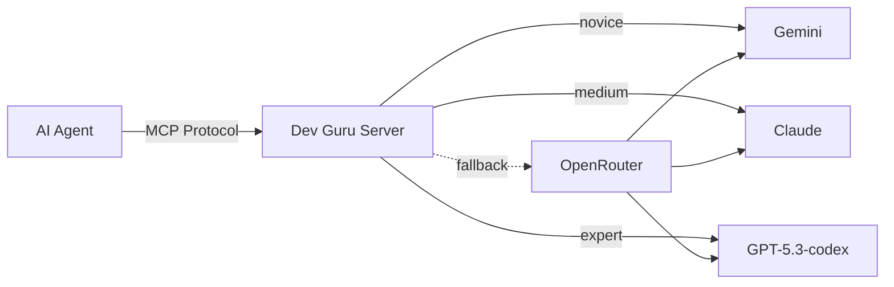

<div align="center">


# 🧘 Dev Guru

**Your AI-powered code consultation MCP server.**

[](https://python.org)
[](https://fastapi.tiangolo.com)
[](https://modelcontextprotocol.io)
[](https://docker.com)
[](LICENSE)

*When you're stuck, afraid, or just lazy to ask for help — Dev Guru is here.*

---

</div>

## 💡 What is Dev Guru?

Dev Guru is a specialized **MCP (Model Context Protocol) server** that acts as an on-demand senior code consultant for AI agents. It routes coding problems to the most suitable AI model based on the requested expertise level, providing structured, actionable feedback.

> Think of it as a **second brain for your AI agent** — a guru it can consult when facing tough coding decisions.

## 🎯 Use Cases

| Scenario | How Dev Guru Helps |
|---|---|
| 🐛 **Debugging Complex Issues** | Your agent is stuck on a tricky bug. It calls Dev Guru with the context and gets expert-level reasoning and suggestions. |
| 🏗️ **Architecture Decisions** | Unsure about a design pattern? Dev Guru analyzes your code structure and recommends the best approach. |
| 🔄 **Code Review on Demand** | Submit code for review and get structured feedback with a `thinking` process and concrete `suggestions`. |
| 🤔 **Validating Reasoning** | Your agent has an idea but isn't confident. Dev Guru validates the reasoning and either confirms or corrects the approach. |
| ⚡ **Multi-Model Leverage** | Automatically routes to Gemini, Claude, or GPT based on the complexity level — getting the right model for the right job. |

## ✨ Features

- 🧠 **Expert-based Routing** — Automatically selects the best AI model for the task:
  - `novice` → **Gemini** (fast, efficient)
  - `medium` → **Claude** (balanced, analytical)
  - `expert` → **OpenAI GPT** (deep reasoning)
- 🔀 **OpenRouter Fallback** — If a primary API key is missing, seamlessly falls back to OpenRouter
- 🎛️ **Configurable Models** — Choose exactly which model to use per level via environment variables
- ⚡ **FastMCP Core** — High-performance MCP server implementation
- 📦 **Skill Management API** — Dynamic skill installation and management via REST
- 🐳 **Docker Ready** — Multi-stage build with `uv` for efficient containerized deployments
- 🧩 **Agno Framework** — Leverages Agno for agent orchestration and structured outputs

## 🚀 Quick Start

### Prerequisites

- Python 3.12+
- [`uv`](https://docs.astral.sh/uv/) (recommended)
- At least one API key: **Gemini**, **Anthropic**, **OpenAI**, or **OpenRouter**

### Installation

```bash
# Clone the repository
git clone https://github.com/your-user/dev-guru.git
cd dev-guru

# Create your environment file
cp .env.example .env
# Edit .env with your API keys

# Install dependencies
uv sync
```

### Running

```bash
# Start the full API + MCP server
uv run python main.py
```

### Docker

```bash
docker compose up --build
```

## ⚙️ Configuration

### Environment Variables

| Variable | Description | Default |
|---|---|---|
| `GEMINI_API_KEY` | Google Gemini API key | — |
| `ANTHROPIC_API_KEY` | Anthropic Claude API key | — |
| `OPENAI_API_KEY` | OpenAI API key | — |
| `OPENROUTER_API_KEY` | OpenRouter API key (universal fallback) | — |
| `API_KEY` | Optional API key to protect REST and MCP endpoints | — |
| `NOVICE_MODEL` | Model ID for novice level | gemini-3.1-pro-preview |
| `MEDIUM_MODEL` | Model ID for medium level | claude-opus-4.6 |
| `ADVANCED_MODEL` | Model ID for expert level | gpt-5.3-codex |
| `PORT` | Server port | `8000` |
| `DEBUG` | Debug mode | `true` |

> **Tip:** You only need an `OPENROUTER_API_KEY` to use all three levels — it acts as a universal fallback for any missing provider key.

## 🔌 MCP Configuration

Add Dev Guru to your MCP client (Claude Desktop, Cursor, etc.):

```json
{
  "mcpServers": {
    "dev-guru": {
      "command": "uv",
      "args": [
        "--directory",
        "/path/to/dev-guru",
        "run",
        "python",
        "src/server.py"
      ]
    }
  }
}
```

## 📡 API Endpoints

### Skill Management

| Method | Endpoint | Description |
|---|---|---|
| `GET` | `/skills` | List all loaded skills |
| `GET` | `/skills/{name}` | Get details of a specific skill |
| `POST` | `/skills` | Install a skill (URL or base64 zip) |
| `POST` | `/skills/upload` | Install a skill via file upload |
| `DELETE` | `/skills/{name}` | Delete a skill |

### MCP Tool

| Tool | Parameters | Description |
|---|---|---|
| `call_guru` | `level`, `technologies`, `context`, `thinking` | Consult the guru about a coding problem |

## 🧪 Testing

```bash
PYTHONPATH=. uv run pytest
```

## 🏗️ Architecture



---

<div align="center">

**Built with 🧘 by devs, for devs.**

</div>
